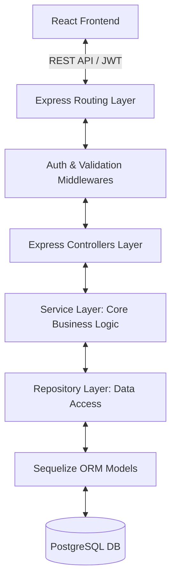
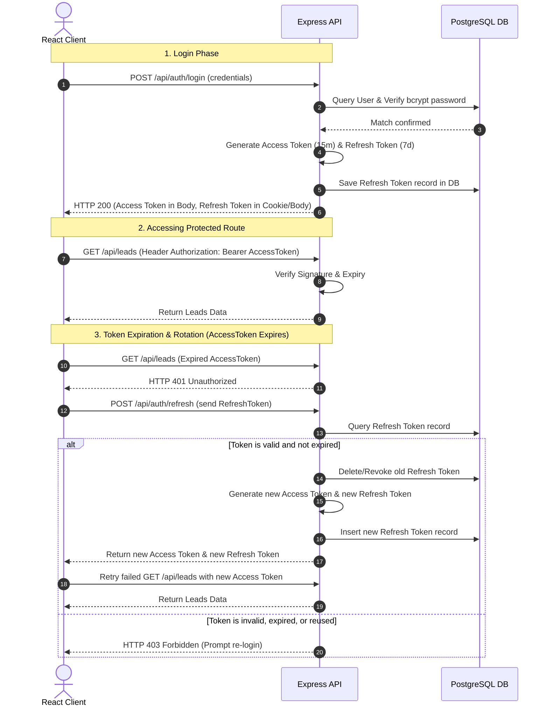
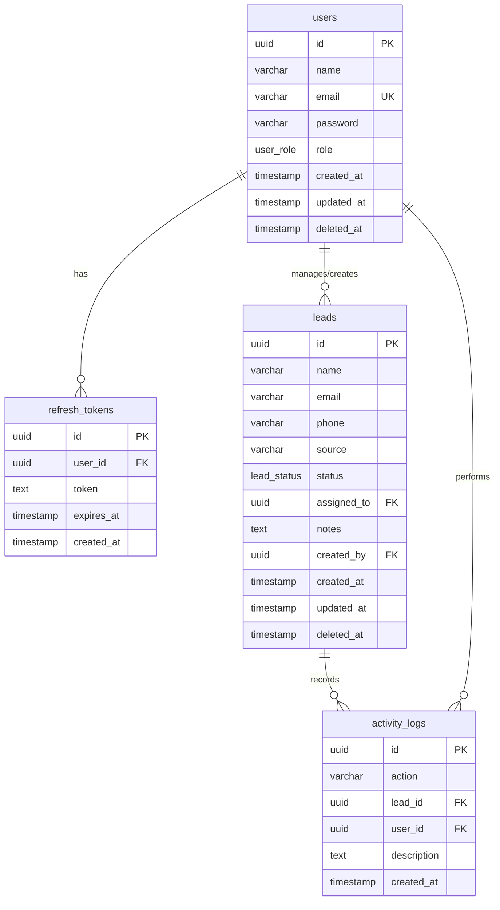

# Super Interview Preparation Guide: Mini Lead Management System

This document is a comprehensive technical preparation guide designed to help you confidently explain your Mini Lead Management System during software engineering interviews. It details the system architecture, design decisions, database layout, security measures, and includes expected mock interview questions.

---

## 1. Project Overview

### Project Summary & Business Goal
The **Mini Lead Management System** is a production-grade, secure, and responsive web application built to streamline how sales leads are captured, assigned, tracked, and audited. The primary business goal is to solve the classic "speed-to-lead" bottleneck and prevent lead leakage. It achieves this by automatically distributing incoming leads to the least-loaded sales agents in real-time, enforcing security limits, and providing a clean dashboard interface for administrators, managers, and agents to collaborate.

### Main Functionalities
- **User Management & RBAC**: Three distinct user roles (`ADMIN`, `MANAGER`, `AGENT`) with fine-grained endpoint authorization and view scaffolding.
- **Lead Operations (CRUD)**: Creation, retrieval, updating, and soft deletion of leads.
- **Auto-Assignment Engine**: Intelligent, concurrent-safe auto-assignment of leads to the sales agent with the lowest active lead load.
- **Audit Logging**: Comprehensive, automated activity logging for critical status changes, lead updates, logins, and assignments.
- **Lead Suggestion Engine**: Enriches candidate profiles by integrating with the external randomuser.me API.
- **Analytics Dashboard**: Real-time stats showing active leads, conversion rates, agent distribution charts, and audit timelines.

### Technologies Used
| Component | Technology | Rationale |
| :--- | :--- | :--- |
| **Backend Framework** | Node.js, Express.js | Event-driven, non-blocking I/O ideal for API routing and high concurrency. |
| **Database** | PostgreSQL | ACID-compliant, robust transaction support, rich query capabilities. |
| **Database Abstraction** | Sequelize (ORM) | Schema migrations, associations, transactions, and built-in soft delete (paranoid mode). |
| **Frontend Framework** | React.js, Vite | Component-based, SPA performance, Fast Refresh dev environment. |
| **Authentication** | JSON Web Tokens (JWT) | Stateless auth, access token + refresh token rotation (RTR) via HttpOnly cookies. |
| **Styling** | Bootstrap 5 | Rapid UI prototyping, responsive grid layout, clean components. |
| **Deployment** | Docker & Docker Compose | Multi-container isolation for backend, frontend (NGINX), and PostgreSQL DB. |
| **Documentation** | Swagger / OpenAPI | Auto-generated interactive API documentation and testing interface. |
| **Task Queues (Simulation)**| BullMQ / Redis-ready | Scalable asynchronous processing of notifications and webhooks. |

---

## 2. Architecture Explanation

The project is structured around the **Separation of Concerns (SoC)** principle, employing a classic Layered Architecture pattern. This ensures high testability, maintainability, and clean decoupling of business logic from HTTP protocols and database dialects.



### Folder Structure Overview
- **Routes (`src/routes`)**: The entry point for HTTP requests. Determines which path maps to which controller action. It applies validation and authorization middleware here.
- **Controllers (`src/controllers`)**: Responsible for handling HTTP-specific tasks. They extract request parameters, query strings, headers, and bodies, pass them down to the Service Layer, and send back standardized JSON responses. **No business logic lives here.**
- **Services (`src/services`)**: The heart of the application. Encapsulates all domain-specific workflows, business rules, and multi-record transactions (e.g., auto-assigning a lead, sending emails, generating audit logs).
- **Repositories (`src/repositories`)**: Abstraction layer over data access. Instead of controllers or services making arbitrary Sequelize calls, the repository exposes clean, domain-specific methods (e.g., `findLeastLoadedAgent`, `findById`). This decouples the ORM queries from the service logic, making it easy to swap the ORM or database driver in the future.
- **Middleware (`src/middleware`)**: Cross-cutting concerns such as checking authentication tokens, authorization checks based on user roles, rate limiting, and global error handling.
- **Database Layer (`src/models`)**: Defines table schemas, model attributes, datatypes, and associations (e.g., a User has many Leads, a Lead belongs to an Agent).

### Why Service Layer Architecture was Used
In a simple MVC framework, developers often dump database queries and business calculations directly into Controllers. This is known as the "Fat Controller" anti-pattern. We separated our service layer because:
1. **Reusability**: The lead auto-assignment logic can be triggered by a REST API endpoint, a background job queue, or a seeding script without duplicating code.
2. **Separation of concerns**: Controllers focus strictly on HTTP protocols (status codes, headers, req/res objects), while Services focus purely on business criteria.
3. **Transaction boundaries**: Service methods are responsible for initializing database transactions, committing them when operations succeed, and rolling them back on failures.

---

## 3. Authentication Flow

Authentication is designed using a stateless **JWT (JSON Web Token) Access & Refresh Token Rotation** strategy. This provides high security while remaining horizontally scalable.

### JWT Authentication Protocol
1. **Access Token**: Short-lived (e.g., 15 minutes) signed token containing user identity details (`id`, `email`, `role`, `name`). Passed in the HTTP `Authorization: Bearer <token>` header to authenticate API endpoints.
2. **Refresh Token**: Long-lived (e.g., 7 days) token stored securely in the PostgreSQL database (`refresh_tokens` table) and transmitted to the client either in a secure, `HttpOnly` cookie or as a fallback token. Used strictly to obtain a new Access Token.

### Refresh Token Rotation (RTR)
To prevent replay attacks if a refresh token is stolen, we implement **Refresh Token Rotation (RTR)**:
* Each time a client requests a new access token using a refresh token, the server validates the refresh token against the database.
* Upon validation, the server immediately **deletes/revokes** the old refresh token, generates a brand new access token, generates a **new** refresh token, records it in the database, and returns both to the client.
* If a compromised refresh token is reused, the database lookup fails because it has already been deleted. This alerts the system to a potential breach, and the server can invalidate all active sessions for that user.

### Authentication & Token Rotation Flow Diagram



---

## 4. Database Design Explanation

PostgreSQL was chosen as our relational database engine because of its strong ACID compliance, robust support for transactions, and advanced indexing capabilities. These features are critical for ensuring consistency and preventing race conditions during concurrent lead assignments.

### Relational Schema & Table Definitions
We defined 4 tables with strong relationships and indexes:



1. **`users` Table**: Stores administrative staff, managers, and sales agents.
2. **`refresh_tokens` Table**: Stores active, unexpired refresh tokens linked to a user. Used to enforce sessions and rotation boundaries.
3. **`leads` Table**: Core repository for incoming prospective clients. Has foreign key associations with `users` (`assigned_to` and `created_by`).
4. **`activity_logs` Table**: Audit trail capturing every meaningful status change, re-assignment, and access event.

### Indexing Strategy
To ensure high-performance lookups at scale, we created target indexes:
* **Unique partial index** on `users(email)` where `deleted_at IS NULL` to support fast, soft-delete-compliant logins.
* **Secondary single-column indexes** on `leads(status)`, `leads(source)`, `leads(assigned_to)`, and `leads(created_at)`.
* **Composite Index** on `leads(assigned_to, status) WHERE deleted_at IS NULL` to speed up the subquery that counts active leads assigned to each agent.
* **Descending Index** on `activity_logs(created_at DESC)` to optimize pagination on audit log views.

### UUID vs. Integer IDs
We opted for **UUIDv4** (`gen_random_uuid()`) instead of auto-incrementing integer IDs for primary keys:
1. **Security**: Sequential IDs expose resource counts to external users (e.g., `/leads/1` vs. `/leads/2`) and invite scraping/enumeration attacks.
2. **Scalability**: UUIDs can be safely generated on the application layer or isolated database shards without consulting a single centralized sequence generator, preventing key conflicts.

### Soft Delete & Paranoid Mode
To prevent accidental data loss, the system implements **Soft Deletes** on `leads` and `users`. When a record is deleted, Sequelize sets a timestamp on the `deleted_at` column instead of running a hard SQL `DELETE`. All default SELECT queries append a filter `deleted_at IS NULL`.
* *Audit Trail Integration*: Soft deletes of leads trigger a record in the `activity_logs` table (`Lead 'John Doe' soft-deleted`) before updating the DB row.

---

## 5. Lead Assignment Logic & Concurrency

The auto-assignment engine distributes incoming leads to the sales agent with the lowest workload. Workload is defined as the count of active leads assigned to them. An active lead is a lead whose status is **not** `'Lost'` or `'Closed'`.

### The Concurrency Problem (Race Conditions)
In a high-traffic production system, multiple leads can be submitted at the exact same millisecond. If we query the database using a simple `SELECT` to find the least loaded agent, two concurrent requests might find the same agent as the least-loaded. Both requests will assign their leads to that agent simultaneously. This creates an unfair distribution of work (a race condition).

### The Solution: SELECT FOR UPDATE Row Locking
To serialize this operation and guarantee atomic updates, we use a database transaction coupled with a **Pessimistic Locking** clause (`FOR UPDATE`).

```sql
SELECT u.id, u.name, COUNT(l.id) AS active_count
FROM users u
LEFT JOIN leads l ON u.id = l.assigned_to 
  AND l.status NOT IN ('Lost', 'Closed') 
  AND l.deleted_at IS NULL
WHERE u.role = 'AGENT' AND u.deleted_at IS NULL
GROUP BY u.id
ORDER BY active_count ASC, u.created_at ASC
LIMIT 1
FOR UPDATE OF u;
```

#### Step-by-Step Transaction Workflow
1. **Transaction Initialization**: The `LeadService.createLead` method spawns a new Sequelize transaction (`const t = await sequelize.transaction()`).
2. **Locking Query Execution**: The `findLeastLoadedAgent` raw query executes inside the transaction context.
3. **Pessimistic Locking**: The `FOR UPDATE OF u` clause locks the returned `user` row. Any other concurrent transaction trying to run `findLeastLoadedAgent` will block/wait at this step until the first transaction commits or rolls back.
4. **Lead Creation**: The system creates the new lead in the `leads` table, associating it with the locked agent's ID.
5. **Auditing**: Audit log entries are written (`Lead Assigned`) within the same transaction.
6. **Commit**: The transaction is committed. The row lock is released, allowing the next queued assignment transaction to fetch the updated counts and lock its target agent.
7. **Rollback**: If any error occurs (e.g., constraint failure or timeout), the transaction is rolled back, and all locked rows are immediately released.

---

## 6. API Design Decisions

The backend implements a highly standard **RESTful API** layout designed for predictability, ease of integration, and performance.

### Centralized API Response Structure
Every controller endpoint returns a consistent JSON payload, simplifying frontend parsing:

* **Success Response (HTTP 200 / 201)**:
  ```json
  {
    "success": true,
    "data": { ... },
    "pagination": { "total": 120, "page": 1, "limit": 10, "pages": 12 }
  }
  ```
* **Failure Response (HTTP 400 / 401 / 403 / 404 / 500)**:
  ```json
  {
    "success": false,
    "message": "Validation failed",
    "errors": [
      { "field": "email", "message": "Must be a valid email address" }
    ]
  }
  ```

### Pagination, Filtering, and Sorting
To prevent high memory usage on both the database and client, the `GET /api/leads` route enforces serverside pagination, sorting, and filtering:
* **Pagination**: Uses standard SQL `LIMIT` and `OFFSET` calculated via query parameters `page` and `limit`.
* **Filtering**: Supports dynamic SQL `WHERE` clauses for `status` and `source`.
* **Case-Insensitive Searching**: Uses PostgreSQL `iLike` operator (`%search%`) to query the `name`, `email`, and `phone` columns.
* **Sorting**: Accepts `sortBy` (e.g. `createdAt`, `name`) and `sortOrder` (`ASC` or `DESC`) parameters, mapping them to DB columns safely.

### Input Validation Strategy
We use **`express-validator`** to declare schema validation rules directly in the routing layer (e.g., `validateRegister`, `validateLogin`, `validateLead`). Requests with malformed data are rejected with an `HTTP 400 Bad Request` before they reach the controller or services, protecting the database from invalid data.

---

## 7. Frontend Architecture (React)

The frontend is built with React and Vite. It is organized by feature modules, separating presentation components from business logic and routing wrappers.

```
frontend/src/
├── api/             # Axios instance & interceptors config
├── components/      # Reusable visual components (Navbar, Sidebar, Charts)
├── context/         # AuthContext for global session state
├── layouts/         # Page templates (DashboardLayout)
├── pages/           # Route view pages (LoginPage, LeadListPage, Details)
├── routes/          # ProtectedRoute component wrapper
├── App.jsx          # Root component declaring Routes
└── main.jsx         # App mounting point
```

### Axios Interceptors & Refresh Token Queuing
Our HTTP client (`api/axios.js`) implements a request and response interceptor to handle token renewal seamlessly:
* **Request Interceptor**: Automatically inspects `localStorage` for an `accessToken` and inserts the `Authorization: Bearer <token>` header if present.
* **Response Interceptor**: Listens for HTTP responses. If the backend returns `HTTP 401 Unauthorized`, it indicates the access token has expired.
* **Queuing Concurrent Requests**: To prevent duplicate refresh requests, we use an `isRefreshing` flag and a `failedQueue` array:
  1. The first 401 request sets `isRefreshing = true` and sends a POST request to `/auth/refresh`.
  2. While the refresh request is active, any other concurrent API requests that fail with a 401 are held in a `failedQueue` promise wrapper.
  3. Once the refresh call succeeds, the new access token is stored in `localStorage`, default headers are updated, the queued requests are retried with the new token, and `isRefreshing` is set to `false`.
  4. If the refresh call fails (e.g., refresh token is expired or revoked), the interceptor clears local storage, triggers an `auth-logout` event to redirect the user to `/login`, and rejects the promise.

### Role-Based Protected Routes
Page routes are protected using a wrapper component (`ProtectedRoute.jsx`). This component reads the user's role from the authentication context.
* If a user is unauthenticated, they are redirected to `/login`.
* If a route requires specific roles (e.g., `allowedRoles={['ADMIN', 'MANAGER']}`) and the user does not possess them, they are redirected to `/unauthorized` or back to the dashboard, preventing unauthorized views.

---

## 8. Security Implementation

The application uses defense-in-depth principles to protect the backend API and database:

| Threat Vector | Mitigation Strategy | Implementation Details |
| :--- | :--- | :--- |
| **Password Theft** | bcrypt Hashing | Passwords are salted and hashed (using a cost factor of 10) before database insertion. |
| **HTTP Headers Vulnerability** | Helmet | Sets secure headers (CSP, HSTS, X-Frame-Options) to mitigate MIME-type sniffing and clickjacking. |
| **Cross-Origin Access** | CORS | Configures an origin whitelist and enables `credentials: true` to support HTTP-only cookies. |
| **Denial of Service (DoS)** | Express Rate Limiter | Restricts clients to a maximum number of requests (e.g., 100 requests per 15 minutes) per IP address. |
| **SQL Injection** | ORM Parameterization | Sequelize automatically binds query parameters for all standard commands. Raw queries use parameter bindings or escaped replacements. |
| **XSS (Cross-Site Scripting)** | Input Sanitization Middleware | Filters all incoming request bodies, queries, and params to strip out malicious HTML and script tags. |
| **Token Hijacking** | Secure Cookies | Refresh tokens are delivered via `HttpOnly`, `Secure` (in production), and `SameSite=Strict` cookies. |

---

## 9. Scalability Considerations

While designed as a monolith, the system is architected to scale horizontally under heavy traffic loads.

### Redis Caching Readiness
1. **Session Blacklists**: Can be integrated to store revoked refresh tokens and query them in O(1) time.
2. **Dashboard Query Caching**: Dashboard aggregation stats (e.g., total leads, agent counts) can be cached in Redis with a short time-to-live (TTL, e.g., 60 seconds) to reduce database load.

### Asynchronous Queue Integration (BullMQ)
For heavy operations such as sending emails, triggering outbound webhooks, or syncing with third-party CRMs (e.g., Salesforce), we simulated a background job processor. In production, this can be swapped with **BullMQ** and **Redis**:
* The main API threads quickly save lead data and enqueue a job (e.g., `EmailQueue.add(...)`).
* Dedicated worker processes consume and retry jobs in the background, keeping the core API responsive.

### Database Optimizations
* **Database Sharding/Replication**: We can route read queries to PostgreSQL read-replicas, while directing write queries (like lead creations and status updates) to the primary node.
* **Partitioning**: The `activity_logs` table can be partitioned by month or year to keep index sizes manageable as logs grow.

---

## 10. Third-Party API Integration

The system includes a lead suggestion feature that integrates with the external **RandomUser API** to populate placeholder lead profiles.

### Integration Details
* **Async Request Execution**: The integration uses `axios` to fetch data from the external API inside the service layer.
* **Timeout Protection**: The request specifies a `timeout: 5000` (5 seconds). This prevents the application from blocking if the third-party service experiences downtime.
* **Graceful Degradation**: If the API call fails, the error is caught, logged internally, and a user-friendly error message is returned. This ensures the main lead management features continue to work even if the external service is unavailable.

---

## 11. Dashboard & Aggregation Queries

The dashboard aggregates key metrics to show lead distribution and conversion performance:
* **Metrics Rendered**: Total Leads, Active Leads, Conversion Rate (Leads closed / total leads), and Sources.
* **SQL Group By Queries**: Run behind the scenes using Sequelize aggregates to group leads by status or source, ensuring calculations occur on the database engine.
* **Real-time Activity Feed**: Fetches the latest 10 rows from the `activity_logs` table using index-optimized descending sorts.

---

## 12. Docker & Deployment

The application uses multi-container Docker configurations for easy local setup and cloud deployment.

### Docker Compose Architecture
We use a `docker-compose.yml` file to orchestrate three isolated services:
1. **`db` (PostgreSQL)**: Spawns the database container. Uses persistent volume mapping (`pg_data`) to prevent data loss when containers restart.
2. **`backend`**: Builds the Node/Express image. Waits for the database container to be healthy using health check checks before launching.
3. **`frontend`**: Uses a multi-stage Dockerfile:
   - **Stage 1 (Build)**: Compiles the React SPA using Vite.
   - **Stage 2 (Production Server)**: Deploys the static build files to a lightweight **NGINX** server. NGINX is configured to forward API calls (`/api/*`) to the backend container.

---

## 13. Common Interview Questions & Answers

### Backend Concepts

#### Q: Why Node.js and Express.js?
**A:** Node.js uses an event-driven, non-blocking I/O model, making it lightweight and efficient for handling high numbers of concurrent requests. Express provides a simple routing system and middleware ecosystem that allows us to build REST APIs quickly without unnecessary boilerplate.

#### Q: Why did you use a Service Layer?
**A:** Using a Service Layer helps separate business logic from HTTP controller actions. Controllers only handle request validation and response formatting. The core business rules, database transactions, and integrations live inside reusable services, which makes the codebase easier to maintain and test.

#### Q: What is the difference between Authentication and Authorization?
**A:** Authentication (AuthN) verifies **who** a user is (e.g., checking credentials or JWT signatures). Authorization (AuthZ) verifies **what** an authenticated user is allowed to do (e.g., checking if their role allows them to delete a lead).

#### Q: How does the Node.js Event Loop work?
**A:** Node.js executes JavaScript code in a single-threaded runtime. It delegates blocking tasks (like file access or database queries) to the OS kernel or thread pool (libuv). When those asynchronous operations finish, they place callbacks onto task queues. The Event Loop continuously checks if the call stack is empty; when it is, it pushes callbacks from the queues onto the stack to be executed.

---

### Database Concepts

#### Q: Why choose PostgreSQL over MongoDB?
**A:** PostgreSQL is a relational database that excels at handling structured data with complex relationships. It provides strict schema enforcement, foreign key constraints, and transactional consistency (ACID compliance). These features are critical for lead auto-assignment, where we need to lock rows and update workloads reliably. MongoDB, as a document store, does not guarantee relational integrity as naturally.

#### Q: What are SQL Indexes, and how do they work?
**A:** Indexes are data structures (typically B-Trees) that store pointer references to table rows based on column values. They speed up search queries from O(N) full table scans to O(log N) lookups. However, indexes slow down write operations because the index structure must be updated whenever rows are inserted, updated, or deleted.

#### Q: What are ACID properties?
**A:** ACID stands for:
* **Atomicity**: Either all operations in a transaction succeed, or the entire transaction is rolled back.
* **Consistency**: Transactions only transition the database from one valid state to another, preserving constraints.
* **Isolation**: Concurrent transactions execute independently without interfering with each other.
* **Durability**: Committed data is written to non-volatile storage and will persist even during power loss.

#### Q: Why use UUIDs instead of auto-incrementing Integers?
**A:** Auto-incrementing integers make database sharding difficult because multiple databases can generate conflicting IDs. They also expose sequential resource sizes in URLs (e.g., `/leads/100`), which makes it easy for attackers to scrape data. UUIDs are universally unique 128-bit values that can be safely generated client-side or on isolated nodes without collisions.

---

### Frontend Concepts

#### Q: Why React?
**A:** React uses a virtual DOM to optimize UI rendering. It only updates the parts of the real DOM that have changed, which makes the application feel fast and responsive. Its component-based design also makes it easy to build and reuse UI elements.

#### Q: What is the Context API in React?
**A:** The Context API provides a way to pass data down the component tree without manually passing props through every level (prop drilling). In this project, we use it to manage user authentication state globally.

#### Q: What is the purpose of `useEffect`?
**A:** The `useEffect` hook allows components to perform side effects, such as fetching data from an API, subscribing to events, or cleaning up resources when components unmount. It runs after the component renders.

---

### System Design & Scalability

#### Q: How would you scale the lead creation API to handle 100,000 requests per minute?
**A:** 
1. **Vertical Partitioning**: Decouple the lead creation logic from the assignment engine. Instead of assigning leads synchronously, the API can quickly write the lead to a fast database or queue and return an HTTP 202 Accepted status.
2. **Message Broker**: Introduce an AMQP message broker (like RabbitMQ) or a Redis-backed queue (like BullMQ). The API puts incoming leads into the queue, and background workers process the auto-assignment logic asynchronously.
3. **Load Balancing**: Run multiple instances of the Express API service behind an NGINX load balancer to distribute the request traffic.

#### Q: How does Redis help?
**A:** Redis is an in-memory key-value store that can be used for caching and session storage. By caching database queries (like active lead counts) with a short TTL, we can reduce database read loads. We can also use it to manage session stores or rate-limiting tokens efficiently.

---

## 14. Challenges Faced & Solutions

### Challenge 1: Concurrency and Race Conditions in Auto-Assignment
- **The Problem**: During testing, concurrent lead submissions assigned multiple leads to the same agent simultaneously, even though they should have been distributed evenly.
- **The Solution**: We wrapped the selection query in a database transaction and used `SELECT ... FOR UPDATE OF u` to lock the selected agent's row. This serialized the auto-assignment process and ensured the distribution remained balanced.
- **The Learning**: Learned how to identify race conditions under high concurrent loads and how to use pessimistic locking in PostgreSQL to maintain transactional consistency.

### Challenge 2: Handling Access Token Expiration Gracefully
- **The Problem**: Short-lived access tokens improved security but caused API requests to fail. Users were frequently logged out when their tokens expired.
- **The Solution**: We implemented an Axios response interceptor that intercepts 401 errors. It pauses subsequent requests, sends a request to `/auth/refresh` to get a new access token, updates the Authorization header, and retries the original request.
- **The Learning**: Gained experience managing complex asynchronous states in Axios interceptors and implementing automatic token refresh flows.

---

## 15. Future Improvements

1. **Production Redis Cache**: Cache the dashboard statistics to improve page load times.
2. **Real-time WebSockets**: Implement socket.io to update lead lists and dashboards in real-time when new leads are created.
3. **Email and Push Notifications**: Add automated email alerts using Nodemailer and a background queue.
4. **Elasticsearch for Searching**: Transition lead search queries from PostgreSQL `iLike` scans to Elasticsearch to support fuzzy search on millions of records.
5. **CI/CD Pipelines**: Automate test runs and Docker image builds using GitHub Actions.

---

## 16. HR & Behavioral Interview Answers

### Q: Tell me about yourself.
**A:** "I am a software engineer focused on building robust, scalable web applications. Throughout my career, I've worked with Node.js, Express, React, and relational databases. In my projects, I prioritize writing clean code, implementing proper security measures, and optimizing database performance. I enjoy working on complex backend challenges like concurrency safety and database optimizations, but I also enjoy building clean, intuitive frontend interfaces."

### Q: Why should we hire you?
**A:** "I have hands-on experience building full-stack applications with Node.js and React, and I understand the importance of database performance and security. I don't just write code that works; I think about database locks, API request validation, and token rotation security. I am excited to bring my technical skills and problem-solving mindset to your engineering team."

---

## 17. Quick Revision Notes

### Core Database Locks
* **Shared Lock**: Allows concurrent transactions to read a row but prevents them from modifying it.
* **Exclusive Lock (`FOR UPDATE`)**: Prevents other transactions from reading, locking, or modifying a row until the current transaction completes.

### JWT Security Best Practices
* **Access Tokens**: Short expiration (15m), stored in-memory.
* **Refresh Tokens**: Long expiration (7d), stored in `HttpOnly`, `SameSite=Strict` cookies.
* **Rotation**: Revoke and issue new tokens on every refresh request to prevent token replay attacks.

### Node Event Loop Phases
1. **Timers**: Executes callbacks scheduled by `setTimeout` and `setInterval`.
2. **Pending Callbacks**: Executes I/O callbacks deferred from the previous loop iteration.
3. **Idle, Prepare**: Used internally by Node.
4. **Poll**: Retrieves new I/O events and executes I/O-related callbacks.
5. **Check**: Executes `setImmediate` callbacks.
6. **Close Callbacks**: Executes close event callbacks (e.g., `socket.on('close')`).

---

## 18. Final Interview Tips

1. **Lead with "Why"**: When explaining the system, don't just say *what* you built. Explain *why* you chose specific tools (e.g., "I used PostgreSQL transactions and `SELECT FOR UPDATE` to prevent race conditions during auto-assignment").
2. **Be Honest**: If you don't know the answer to a question, explain how you would go about finding the answer.
3. **Use the STAR Method**: For behavioral questions, structure your answers using the **Situation, Task, Action, and Result** framework to keep them clear and concise.
